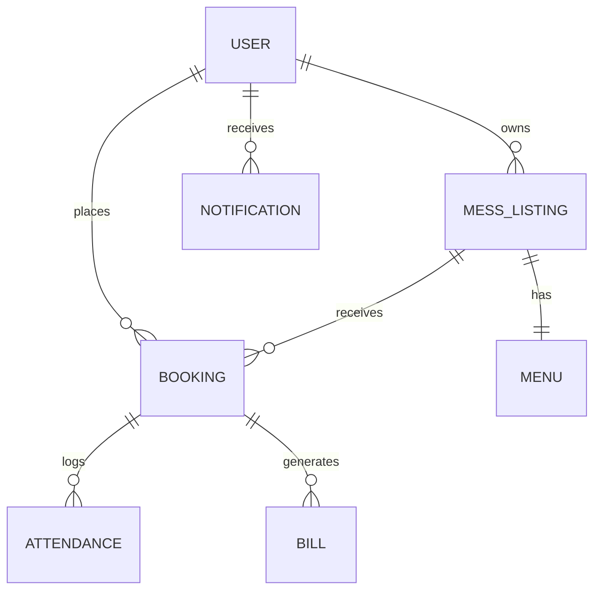

# 🍽️ MessMate — Smart Campus Mess & Tiffin Management Platform

[](https://reactjs.org/)
[](https://opensource.org/licenses/MIT)
[](https://nodejs.org/)
[](https://vitejs.dev/)
[](https://tailwindcss.com/)

> **MessMate** is a full-stack MERN platform that bridges the gap between university students and local mess/tiffin providers. It streamlines mess discovery, enforces a single active subscription per student, simplifies daily attendance tracking, automates end-of-month billing calculations, and provides an end-to-end administration portal.

---

## 🌐 Live Deployment & Links

| Service | Link |
| :--- | :--- |
| **Live Web App** | [https://messmate-mern.onrender.com/](https://messmate-mern.onrender.com/) |
| **API Health & Base URL** | [https://messmate-mern.onrender.com/api/health](https://messmate-mern.onrender.com/api/health) |
| **GitHub Repository** | [https://github.com/rautvv09/MessMate-MERN-PROJECT-](https://github.com/rautvv09/MessMate-MERN-PROJECT-) |

---

## 📑 Table of Contents
- [Key Features](#-key-features)
  - [1. Student Module](#1-student-module)
  - [2. Mess Owner Module](#2-mess-owner-module)
  - [3. Admin Module](#3-admin-module)
  - [4. Automated Billing Engine](#4-automated-billing-engine)
- [Tech Stack](#-tech-stack)
- [System Architecture & Database Design](#-system-architecture--database-design)
- [Getting Started & Local Setup](#-getting-started--local-setup)
  - [Prerequisites](#prerequisites)
  - [Backend Setup](#backend-setup)
  - [Frontend Setup](#frontend-setup)
- [Environment Variables](#-environment-variables)
- [Running Automated Monthly Billing](#-running-automated-monthly-billing)
- [API Endpoints Reference](#-api-endpoints-reference)
- [Deployment Guide](#-deployment-guide)
- [Contributing & License](#-license)

---

## 🌟 Key Features

### 1. Student Module
- **Explore & Compare Messes**: Filter messes across multiple cities (Ichalkaranji, Kolhapur, Miraj, Sangli, Pune, etc.) with real-time search across names, addresses, and nearby colleges.
- **One Student $\to$ One Active Subscription Policy**:
  - Enforces that a student can only hold **one active mess subscription** at any time.
  - Race condition & double-click protection at the MongoDB engine level with partial unique indexes.
  - Active subscription details, expiry countdown, and instant cancellation workflow.
- **Attendance Portal**: Daily meal attendance tracking with live sync for missed meals calculation.
- **Live Monthly Bills**:
  - Deep-linked invoice viewer (`/student/bills/:billId`).
  - Itemized breakdowns of Breakfast, Lunch, and Dinner charges with GST & discounts.
  - Downloadable and printable invoice receipts.
- **Favorites & Reviews**: Save favorite messes and submit ratings/feedback.

### 2. Mess Owner Module
- **Mess & Menu Management**:
  - Complete profile management with image uploads (Cloudinary).
  - Weekly rotating meal schedule editor (Breakfast, Lunch, Dinner, Special Sunday menus).
  - Dynamic pricing setup (per-meal rates, base fees, deposit, GST %).
- **Attendance Scanner & Tracker**:
  - QR code scanner / 1-tap attendance marking for enrolled students.
  - Real-time meal count reports.
- **Billing & Subscriptions**:
  - View all student subscribers and active plans.
  - Automated & manual batch invoice generation for all active students.
  - Payment status tracking (`pending`, `paid`, `overdue`, `partially_paid`).

### 3. Admin Module
- **Global Overview Dashboard**: Platform metrics including total registered students, verified mess owners, active messes, subscription volume, and revenue analytics.
- **Student & Owner Management**: Suspend, verify, or manage student and mess owner accounts.
- **Mess Listing Moderation**: Review, approve, feature, or soft-delete mess listings.
- **Audit Logs & Security**: Comprehensive logging of administrative actions and authentication events.

### 4. Automated Billing Engine
- **Month-End Cron Jobs**: Automated cron scheduled at 23:55 PM on month-end and 00:05 AM on the 1st of every month.
- **Idempotent Billing**: Compound unique indexing guarantees zero duplicate invoices for the same billing cycle.
- **Attendance Locking**: Locks attendance records (`lockedForBilling = true`) upon invoice generation to preserve accounting integrity.
- **Multi-Channel Notifications**: Real-time in-app alerts and email notifications dispatched to both student and mess owner with invoice breakdowns.

---

## 🛠️ Tech Stack

### Frontend
- **Framework**: React 19, Vite
- **Routing**: React Router DOM v7
- **Styling**: Tailwind CSS, PostCSS, Lucide React, React Icons
- **Data Visualization**: Recharts
- **Notifications**: React Hot Toast
- **HTTP Client**: Axios with JWT interceptors

### Backend
- **Runtime**: Node.js & Express.js
- **Database**: MongoDB Atlas with Mongoose ODM
- **Authentication**: JWT (Access Tokens + HTTP-only Refresh Tokens), bcryptjs, Google OAuth 2.0
- **Scheduled Jobs**: `node-cron`
- **File Storage**: Cloudinary SDK & Multer
- **Email Service**: Nodemailer
- **Security**: Helmet, Express Rate Limit, Mongo Sanitize, HPP, CORS

---

## 🏛️ System Architecture & Database Design



### Key Models
- `User`: Handles authentication, role differentiation (`student`, `owner`, `admin`), profile details, and verification status.
- `MessListing`: Stores mess information, geolocation coordinates (`2dsphere`), meal pricing structure, and facilities.
- `Booking`: Represents mess subscriptions, plan types (`Full Day`, `Lunch Only`, etc.), start/end dates, and partial unique index on `{ studentId: 1, status: 'confirmed' }`.
- `Attendance`: Logs daily meal intake (`breakfast`, `lunch`, `dinner`) and handles billing locks.
- `Bill`: Itemized invoice snapshotting meal pricing at billing time, tracking payment status, and due dates.
- `Menu`: Day-by-day weekly meal items for breakfast, lunch, and dinner.
- `Notification`: In-app notification dispatcher for billing, subscriptions, and approvals.

---

## 🚀 Getting Started & Local Setup

### Prerequisites
- Node.js (v18.x or higher)
- npm or yarn
- MongoDB Atlas account (or local MongoDB instance)
- Cloudinary account (for image uploads)

### 1. Clone the Repository
```bash
git clone https://github.com/rautvv09/MessMate-MERN-PROJECT-.git
cd MessMate-MERN-PROJECT-
```

### 2. Backend Setup
```bash
# Navigate to backend directory
cd backend

# Install dependencies
npm install

# Create environment file
cp .env.example .env   # Or create .env based on the template below

# Start development server
npm run dev
```
The backend API will start on `http://localhost:5000`.

### 3. Frontend Setup
```bash
# In a new terminal, navigate to frontend directory
cd frontend

# Install dependencies
npm install

# Create environment file
cp .env.example .env   # Or configure VITE_API_BASE_URL

# Start Vite dev server
npm run dev
```
The frontend client will start on `http://localhost:5173`.

---

## 🔐 Environment Variables

### Backend (`backend/.env`)
```env
# Core Server Configuration
PORT=5000
NODE_ENV=development
CLIENT_URL=http://localhost:5173
FRONTEND_URL=http://localhost:5173

# MongoDB Atlas Connection
MONGO_URI=mongodb+srv://<username>:<password>@cluster.mongodb.net/messmateDB?retryWrites=true&w=majority

# JWT Authentication
JWT_ACCESS_SECRET=your_super_secret_access_key
JWT_ACCESS_EXPIRES_IN=15m
JWT_REFRESH_SECRET=your_super_secret_refresh_key
JWT_REFRESH_EXPIRES_IN=7d

# Cloudinary (Image Uploads)
CLOUDINARY_CLOUD_NAME=your_cloud_name
CLOUDINARY_API_KEY=your_api_key
CLOUDINARY_API_SECRET=your_api_secret

# Email Service (Nodemailer)
SMTP_HOST=smtp.gmail.com
SMTP_PORT=587
SMTP_USER=your_email@gmail.com
SMTP_PASS=your_email_app_password
EMAIL_FROM=MessMate <noreply@messmate.com>

# Google OAuth (Optional)
GOOGLE_CLIENT_ID=your_google_client_id.apps.googleusercontent.com
```

### Frontend (`frontend/.env`)
```env
VITE_API_BASE_URL=http://localhost:5000/api
VITE_GOOGLE_CLIENT_ID=your_google_client_id.apps.googleusercontent.com
```

---

## ⚡ Running Automated Monthly Billing

In production, the billing job triggers automatically on the last day of each month via `node-cron`.

To manually trigger bill generation for development, testing, or historical reconciliation:
```bash
cd backend

# Generate bills for the current month
npm run generate:bills

# Or specify a custom target billing year and month
BILL_YEAR=2026 BILL_MONTH=9 npm run generate:bills
```

---

## 📡 API Endpoints Reference

### 🔐 Auth & Users (`/api/auth`, `/api/users`)
- `POST /api/auth/register` — Register a new student or mess owner
- `POST /api/auth/login` — Login & receive JWT access + refresh tokens
- `POST /api/auth/refresh-token` — Renew expired access token
- `GET /api/users/profile` — Get logged-in user profile

### 🍲 Mess Listings (`/api/messes`)
- `GET /api/messes` — Search, filter by city/food type/rating, and paginate messes
- `GET /api/messes/:id` — Get single mess details and meal pricing
- `POST /api/messes` — Create a new mess listing *(Owner only)*
- `PATCH /api/messes/:id` — Update mess listing *(Owner only)*

### 📝 Subscriptions & Bookings (`/api/subscriptions`, `/api/bookings`)
- `GET /api/subscriptions/active` — Get student's currently active mess subscription
- `GET /api/subscriptions/me` — Get student's subscription history
- `POST /api/bookings` — Subscribe to a mess (Enforces single-active policy with `409 Conflict`)
- `POST /api/subscriptions/:id/cancel` — Cancel an active subscription

### 📅 Attendance (`/api/attendance`)
- `GET /api/attendance/my` — Get logged-in student's attendance records
- `POST /api/attendance/mark` — Mark attendance for a meal *(Student/Owner)*
- `GET /api/attendance/stats` — Attendance summary and missed meals count

### 💳 Invoices & Billing (`/api/bills`)
- `GET /api/bills/my` — Get student's monthly bills and payment status
- `GET /api/bills/mess/:messId` — Get all generated bills for a mess *(Owner only)*
- `GET /api/bills/:id` — Get detailed bill breakdown and print invoice
- `PATCH /api/bills/:id/payment` — Update bill payment status *(Owner only)*

### 🛡️ Administration (`/api/admin`)
- `GET /api/admin/dashboard` — Platform statistics and analytics
- `GET /api/admin/users` — List and filter all users
- `PATCH /api/admin/users/:id/status` — Suspend or activate user
- `GET /api/admin/audit-logs` — View system audit trails

---

## 🚢 Deployment Guide

### Deploying Backend to Render
1. Create a **Web Service** on [Render](https://render.com).
2. Connect your GitHub repository: `https://github.com/rautvv09/MessMate-MERN-PROJECT-`.
3. Set **Root Directory** to `backend`.
4. Build Command: `npm install`
5. Start Command: `npm start`
6. Add your environment variables under the **Environment** tab.

### Deploying Frontend to Vercel
1. Create a **New Project** on [Vercel](https://vercel.com).
2. Import the `MessMate-MERN-PROJECT-` repository.
3. Set **Root Directory** to `frontend`.
4. Framework Preset: **Vite**.
5. Set `VITE_API_BASE_URL` to your production backend URL (e.g. `https://messmate-api.onrender.com/api`).
6. Click **Deploy**.

---

## 📄 License
This project is open-source and licensed under the [MIT License](LICENSE).

---

<p align="center">
  Made with ❤️ by <a href="https://github.com/rautvv09">Vinay Raut</a> and the MessMate Team
</p>